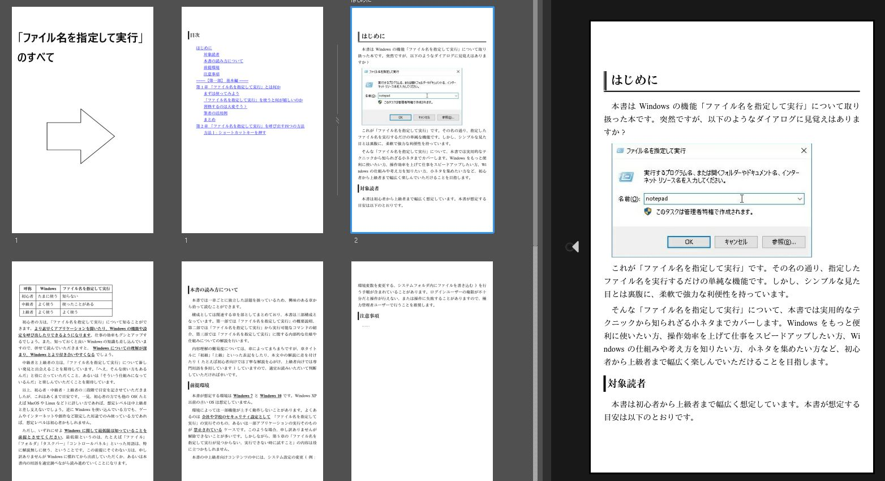

# eBook_sample_with_markdown
Markdown + でんでんコンバーターによる電子書籍作成テンプレート。

- [本文 run.md はこちら](run.md)

## サンプルを epub に変換する方法
[でんでんコンバーター](https://conv.denshochan.com/) に以下をアップロード。

```
cover.jpg
ddconv.yml
default.css
notepad.jpg
run.md
run_dialog.jpg
```

すると `5bc9cea11a8d8.epub` のような epub ファイルをダウンロードできるようになるので、ダウンロードする。

## epub ファイルの閲覧
[Kindle Previewer](https://kdp.amazon.co.jp/ja_JP/help/topic/G202131170) で読み込む。

以下は本サンプルの例。



## リンク
- [Amazon Kindle Direct Publishing](https://kdp.amazon.co.jp/ja_JP/)
- [でんでんコンバーター](https://conv.denshochan.com/)
- [Kindle Previewer](https://kdp.amazon.co.jp/ja_JP/help/topic/G202131170)
