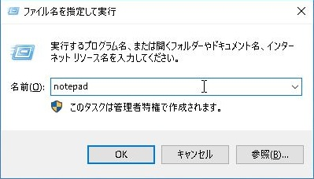
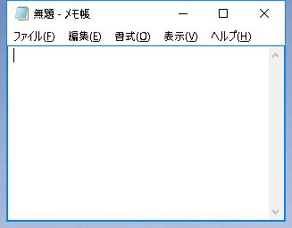

# はじめに
本書は Windows の機能「ファイル名を指定して実行」について取り扱った本です。突然ですが、以下のようなダイアログに見覚えはありますか？

これが「ファイル名を指定して実行」です。その名の通り、指定したファイル名を実行するだけの単純な機能です。しかし、シンプルな見た目とは裏腹に、柔軟で強力な利便性を持っています。

そんな「ファイル名を指定して実行」について、本書では実用的なテクニックから知られざる小ネタまでカバーします。Windows をもっと便利に使いたい方、操作効率を上げて仕事をスピードアップしたい方、Windows の仕組みや考え方を知りたい方、小ネタを集めたい方など、初心者から上級者まで幅広く楽しんでいただけることを目指します。

## 対象読者
本書は初心者から上級者まで幅広く想定しています。本書が想定する目安は以下のとおりです。

| 呼称   | Windows    | ファイル名を指定して実行 |
| ------ | -----------| ------------------------ |
| 初心者 | たまに使う | 知らない                 |
| 中級者 | よく使う   | 使ったことがある         |
| 上級者 | よく使う   | よく使う                 |

初心者の方は、「ファイル名を指定して実行」について知ることができます。**より素早くアプリケーションを開いたり、Windows の機能や設定を呼び出したりできるようになります**。仕事の効率もグンとアップするでしょう。また、知っておくと良い Windows の知識も差し込んでいますので、併せて読んでいただきますと、 **Windows についての理解が深まり、Windows とより付き合いやすくなる** でしょう。

中級者と上級者の方は、「ファイル名を指定して実行」について新しい発見と出会えることを期待しています。「へえ、そんな使い方もあるんだ」と役に立っていただくこと、あるいは「そういう仕組みになっているんだ」と楽しんでいただくことを期待しています。

以上、初心者・中級者・上級者の三段階で目安を記させていただきましたが、これはあくまで目安です。一見、初心者の方でも他の OS(たとえば MacOS や Linux など)に詳しい方であれば、想定レベルは中上級者と差し支えないでしょう。逆に Windows を使い込んでいる方でも、ゲームやインターネットや創作など限定した用途でのみ使っている方であれば、想定レベルは初心者かもしれません。

ただし、いずれにせよ **Windows に関して最低限は知っていることを前提とさせてください**。最低限というのは、たとえば「ファイル」「フォルダ」「タスクバー」「コントロールパネル」といった用語は、特に解説無しに使う、ということです。この前提にそぐわない方は、申し訳ありませんが Windows に慣れてから出直していただくか、あるいは本書内の用語を適宜調べながら読み進めていくことになります。

## 本書の読み方について
本書では一章ごとに独立した話題を扱っているため、興味のある章から拾って読むことができます。

構成としては関連する章を部としてまとめており、本書は三部構成となっています。第一部では「ファイル名を指定して実行」の概要説明、第二部では「ファイル名を指定して実行」から実行可能なコマンドの紹介、第三部では「ファイル名を指定して実行」に関する内部的な仕様や仕組みについての解説を行います。

内容理解の難易度については、章によってまちまちですが、章タイトルに「初級」「上級」といった表記をしたり、本文中の解説に差を付けたり(たとえば初心者向けでは丁寧な解説を心がけ、上級者向けでは専門用語を多用しています)していますので、適宜お読みいただいて判断していただければ幸いです。

## 前提環境
本書が想定する環境は **Windows 7** と **Windows 10** です。Windows XP 以前の古い OS は想定していません。

環境によっては一部機能が上手く動作しないことがあります。よくあるのは **会社や学校のセキュリティ設定として** 「ファイル名を指定して実行」の実行そのもの、あるいは一部アプリケーションの実行そのものが **禁止されている** ケースです。このような場合、申し訳ありませんが解除できないことが多いです。しかしながら、第５章の「ファイル名を指定して実行が見つからない、実行できない時に試すこと」の内容は役に立つかもしれません。

本書の中上級者向けコンテンツの中には、システム設定の変更(例：環境変数を変更する、システムフォルダ内にファイルを書き込む)を行う手順が含まれていることがあります。ログインユーザーの権限が不十分だと操作が行えない、または操作に失敗することがありますので、極力管理者ユーザーで行うことを推奨します。

## 注意事項
……

===

# ====【第一部】 基本編 ====
第一部では「ファイル名を指定して実行」の概要、呼び出し方、使い方など基本的な事項について見ていきます。

# 第１章 「ファイル名を指定して実行」とは何か
そもそも「ファイル名を指定して実行」とは一体何なのでしょうか。本章では概要やメリットなどを見ていきます。

## まずは使ってみよう
文章でくどくど説明してもわかりづらいので、まずは実際に手を動かしてみましょう。

キーボードの「Windows キー」を押しながら「R キー」を押してみてください。「Windows キー」とは、Windows のロゴマークがプリントされたキーのことです。左下の「Ctrl キー」や「Alt キー」の間あたりにあります。

押してみると、下記のような「ファイル名を指定して実行」ダイアログが画面端に表示されると思います。

これが既に何度も述べている「ファイル名を指定して実行」です。

では、続いて、「名前」の入力欄に `notepad` と入力してみましょう。入力したら「Enter キー」を押してください。「OK ボタン」をクリックしても構いません。

すると「メモ帳」が実行された[^1]のではないかと思います。

これが「ファイル名を指定して実行」です。メモ帳というアプリケーション[^2]を、そのファイル名 `notepad` を指定して実行したことを意味します。

[^1]: 「実行された」の別の表現として「起動した」、「開かれた(開いた)」、「立ち上がった」「呼び出された」などがあります。いずれもよく使われるので覚えておくと混乱せずに済みます。

[^2]: アプリケーションとファイルの違いですが、アプリケーションはファイルの一つです。メモ帳にせよ、Microsoft Office の Word や Excel にせよ、ウェブブラウザ Internet Explorer にせよ、アプリケーションはファイルという形で存在しています。ちなみにファイルにはアプリケーションファイル、データファイル、スクリプトファイルなど様々な種類があります。

## 「ファイル名を指定して実行」を使うと何が嬉しいのか
皆さんは「ファイルを開く方法」と聞いた時に、何を思い浮かべるでしょうか。

……

## 習熟するのは大変そう？
ここで、よく言われるのが「マスターするのが大変そう」ということです。

……

## 筆者の活用例
本章の締めとして、筆者の活用例をいくつかご紹介します。本書の内容をマスターすれば、これと同等以上の活用を手に入れることができます。

……

## まとめ
……

===

# 第２章 「ファイル名を指定して実行」を呼び出す四つの方法
「ファイル名を指定して実行」ダイアログを呼び出すにはいくつかの方法があります。ご自身に合った方法を試してみてください。しかし、最も素早いのは「ショートカットキーを押す」なので、こちらを習得されることをオススメします。

## 方法1：ショートカットキーを押す
……
